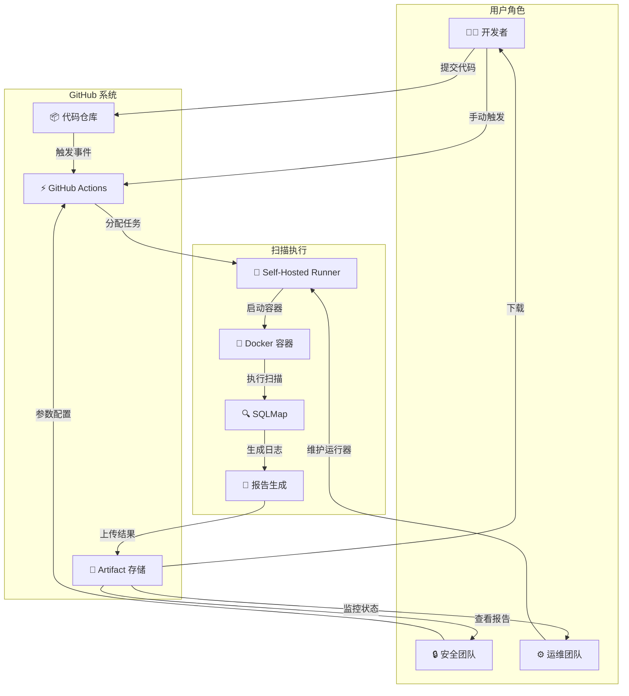

# 🎯 系统 UML 用例图与流程分析

## 📊 系统用例图

### 1. 高级系统用例图

```
 ┌─────────────────────────────────────────────────────────────┐
 │                     SQLMap 安全扫描平台                      │
 ├─────────────────────────────────────────────────────────────┤
 │                                                              │
 │     ┌──────────────┐                                        │
 │     │   开发者      │                                        │
 │     └──────┬───────┘                                        │
 │            │                                                 │
 │            ├─────────────────┬────────────┬────────────┐   │
 │            │                 │            │            │   │
 │     ┌──────▼────────┐  ┌────▼─────┐  ┌──▼───────┐ ┌──▼──────┐
 │     │  Push Code    │  │Commit查看 │  │配置参数  │ │下载报告  │
 │     └───────────────┘  │  历史     │  │并提交    │ │         │
 │                        └──────────┘  └─────────┘ └─────────┘
 │            │
 │     ┌──────▼──────────────────┐
 │     │  GitHub Actions         │
 │     │  (工作流编排系统)        │
 │     └──────┬──────────────────┘
 │            │
 │     ┌──────▼─────────────────┐
 │     │  Self-Hosted Runner    │
 │     │  (任务执行代理)         │
 │     └──────┬─────────────────┘
 │            │
 │     ┌──────▼──────────────────┐
 │     │  Docker 容器           │
 │     │  (SQLMap 扫描工具)      │
 │     └──────┬──────────────────┘
 │            │
 │     ┌──────▼──────────────────┐
 │     │  Python 报告生成器     │
 │     │  (HTML 报告输出)        │
 │     └──────┬──────────────────┘
 │            │
 │     ┌──────▼──────────────────┐
 │     │  GitHub Artifact       │
 │     │  (结果存储和下载)       │
 │     └──────────────────────────┘
 │
 └─────────────────────────────────────────────────────────────┘
```

---

### 2. 详细用例图 (Mermaid)



---

## 🔄 系统流程分析

### Phase 1: 触发事件分析

```
事件来源
├─ 代码 Push (自动触发)
│  └─ 条件: Push 到 main 分支
│     或修改了 security-scanner/ 目录
│
├─ 手动触发 (workflow_dispatch)
│  └─ 条件: GitHub UI 或 CLI 手动启动
│     输入参数: TARGET, LEVEL, RISK
│
└─ 定时触发 (可选配置)
   └─ 条件: 按 cron 表达式定时执行
      例: 每天凌晨 2:00
```

**触发流程图**:
```
┌─────────────────┐
│ 代码变更/手动   │
└────────┬────────┘
         │
         ▼
┌─────────────────────────┐
│ GitHub Event 检测       │
│ (push, workflow_  │
│  dispatch, schedule)    │
└────────┬────────────────┘
         │
         ▼
┌─────────────────────────┐
│ 工作流条件判断          │
│ • 分支是否 main?        │
│ • 文件是否改变?         │
│ • Runner 是否在线?      │
└────────┬────────────────┘
         │
    ┌────┴────┐
    │          │
   YES        NO
    │          │
    ▼          ▼
  启动    等待/取消
```

---

### Phase 2: 工作流执行分析

```
┌─────────────────────────────────────────────────────────┐
│          GitHub Actions 工作流执行                       │
├─────────────────────────────────────────────────────────┤
│                                                         │
│  Job 1: 构建 Docker 镜像                               │
│  ├─ 检查缓存                ← 优化: 缓存已构建的层     │
│  ├─ 构建新层                ← 10-30 秒                 │
│  ├─ 生成镜像 ID              ← 5 秒                    │
│  └─ Push 到注册表 (可选)      ← 10 秒                  │
│  ⏱️ 总耗时: 30 秒            │
│                            │
│  Job 2: SQL 注入扫描         │ (并行执行)
│  ├─ 启动 Runner              ← 5 秒                    │
│  ├─ 拉取 Docker 镜像         ← 5 秒                    │
│  ├─ 启动容器                 ← 2 秒                    │
│  ├─ 验证环境变量             ← 2 秒                    │
│  ├─ 执行 SQLMap 扫描         ← 1-5 分钟 ⭐ 可配置    │
│  ├─ 生成 HTML 报告           ← 5 秒                    │
│  ├─ 压缩结果                 ← 2 秒                    │
│  └─ 上传 Artifact            ← 5 秒                    │
│  ⏱️ 总耗时: 2-5 分钟         │
│                            │
│  Job 3: 后处理 (可选)        │
│  ├─ 发送通知 (Slack/邮件)    │
│  ├─ 创建 PR 评论             │
│  └─ 触发补救流程             │
│  ⏱️ 总耗时: 10 秒            │
│                            │
│  总计: 2-6 分钟              │
│                            │
└─────────────────────────────────────────────────────────┘
```

---

### Phase 3: 容器执行流程分析

```
┌──────────────────────────────────────────────────┐
│     Docker 容器内部执行流程                      │
├──────────────────────────────────────────────────┤
│                                                  │
│  Input Variables (环境变量)                     │
│  ├─ TARGET: 扫描目标 URL          必须         │
│  ├─ LEVEL: 扫描深度 (1-5)         可选 默认:1 │
│  ├─ RISK: 风险等级 (1-3)          可选 默认:1 │
│  └─ TIMEOUT: 超时时间            可选 默认:30 │
│                                                  │
│  ▼                                              │
│                                                  │
│  run_scan.sh 执行                              │
│  ├─ 1. 验证 TARGET 变量存在       ✓            │
│  ├─ 2. 创建输出目录                ✓           │
│  ├─ 3. 构建 SQLMap 命令            ✓           │
│  │   sqlmap -u \"$TARGET\" \\                  │
│  │     --batch \\                             │
│  │     --level=$LEVEL \\                      │
│  │     --risk=$RISK \\                        │
│  │     --output-dir=/scans                    │
│  │                                             │
│  ├─ 4. 执行扫描                    ⭐ 主要耗时 │
│  │   └─ SQLMap 工作:               │          │
│  │      ├─ 连接目标 URL            │          │
│  │      ├─ 枚举参数                │          │
│  │      ├─ 检测注入点              │          │
│  │      ├─ 构建并发送 Payload      │          │
│  │      ├─ 分析响应                │          │
│  │      ├─ 确认漏洞                │          │
│  │      └─ 生成 run.log             │          │
│  │                                 │          │
│  ├─ 5. 调用报告生成器              │          │
│  │   generate_report.py:           │          │
│  │   ├─ find_runlog()              │          │
│  │   │  └─ 查找输出目录中的日志   │          │
│  │   ├─ analyze()                  │          │
│  │   │  └─ 解析漏洞特征           │          │
│  │   └─ render_html()              │          │
│  │      └─ 生成美化的 HTML 报告   │          │
│  │                                 │          │
│  └─ 6. 输出结果                    ✓          │
│     └─ /scans/ 目录:               │          │
│        ├─ run.log (扫描日志)      │          │
│        ├─ report.html (报告)      │          │
│        └─ 其他 SQLMap 文件        │          │
│                                                  │
│  Output Volume Mount: /scans -> 主机路径       │
│                                                  │
└──────────────────────────────────────────────────┘
```

---

### Phase 4: 数据流分析

```
数据对象 (Entity)
├─ ScanTask
│  ├─ id: string
│  ├─ target: URL
│  ├─ level: 1-5
│  ├─ risk: 1-3
│  ├─ status: pending|running|success|failed
│  ├─ created_at: timestamp
│  └─ completed_at: timestamp
│
├─ ScanResult
│  ├─ task_id: string
│  ├─ vulnerabilities: Vulnerability[]
│  ├─ log_content: string
│  ├─ execution_time: seconds
│  ├─ database_type: string
│  └─ payload_samples: Payload[]
│
└─ Report
   ├─ task_id: string
   ├─ html_content: string (美化格式)
   ├─ summary: string
   ├─ findings: Finding[]
   └─ generated_at: timestamp
```

**数据流转**:
```
GitHub Push
    │
    ▼
Event JSON {task_id, target, params}
    │
    ▼
Runner 接收    (/github/workflow/context)
    │
    ▼
Container 执行   (env vars)
    │
    ▼
SQLMap 运行     (生成 run.log)
    │
    ▼
报告生成器解析   (HTML 输出)
    │
    ▼
Artifact ZIP    (上传至 GitHub)
    │
    ▼
用户下载       (本地查看)
```

---

### Phase 5: 状态转换分析

```
任务状态图:
┌─────────────┐
│   created   │    初始状态 (GitHub 事件创建)
└──────┬──────┘
       │
       ▼
┌─────────────┐
│  queued     │    等待中 (等待可用 Runner)
└──────┬──────┘
       │
       ▼
┌─────────────┐
│  in_progress│    执行中 (Runner 正在处理)
└──────┬──────┘
       │
   ┌───┴────┐
   │         │
   ▼         ▼
success   failure
(完成)     (失败)
   │         │
   ▼         ▼
┌─────────────┐
│  completed  │    终止状态
└─────────────┘

扩展状态:
├─ waiting_for_runner    : Runner 离线或无可用资源
├─ container_error       : Docker 容器启动失败
├─ scan_timeout          : SQLMap 超时
├─ scan_error            : 扫描过程出错
├─ report_generation_error: 报告生成失败
└─ upload_failed         : Artifact 上传失败
```

---

### Phase 6: 交互时序图

```
时序图: 完整执行流程

Developer    GitHub    Runner    Docker    SQLMap    Reporter
    │           │         │         │         │          │
    │─ push ─→  │         │         │         │          │
    │       (1) │─ trigger→         │         │          │
    │           │ workflow│         │         │          │
    │       (2) │─ assign-│ task→   │         │          │
    │           │         │         │         │          │
    │           │     (3) │─ pull─→ │         │          │
    │           │         │ (image) │         │          │
    │           │         │         │         │          │
    │           │     (4) │─ run ─→ │─ scan →│          │
    │           │         │         │   (5)  │          │
    │           │         │         │        │ (6)      │
    │           │         │         │        │─→report │
    │           │         │         │        │←─────    │
    │           │         │ (7)     │        │          │
    │           │         │←─────zip────────│          │
    │           │ (8)     │         │        │          │
    │           │←────────result────│        │          │
    │ (9)       │         │         │        │          │
    │←──────────upload────│         │        │          │
    │           │         │         │        │          │
    │ (10)      │         │         │        │          │
    │──download→│         │         │        │          │
    │           │         │         │        │          │

说明:
1. Git webhook 通知 GitHub
2. GitHub Actions 解析工作流
3. Runner 拉取 Docker 镜像
4-5. 运行 SQLMap 扫描
6. 执行报告生成
7. 容器打包结果
8. Runner 上传结果
9. GitHub Artifact 存储
10. 用户下载报告
```

---

## 🎯 各角色用例分析

### 用例 1: 开发者 - 代码提交触发扫描

**参与者**: 开发者, GitHub, GitHub Actions, Runner, SQLMap

**前置条件**:
- Runner 已部署并在线
- SQLMap 容器已构建
- GitHub Token 有效

**基本流程**:
1. 开发者在本地修改代码
2. 提交(commit)和推送(push)到 GitHub
3. GitHub 检测到 push 事件
4. 触发 `security-scan-runner.yml` 工作流
5. 工作流在 Runner 上执行
6. 容器启动 SQLMap 进行扫描
7. 生成 HTML 报告
8. 上传结果至 Artifact
9. 开发者下载报告查看结果
10. 根据结果修复漏洞(循环回到步骤 1)

**异常流程**:
- 若 Scanner Runner 离线: 工作流等待 → 超时失败
- 若目标不可达: SQLMap 连接失败 → 报错
- 若网络异常: 扫描中断 → 失败

**后置条件**:
- 报告已生成并存储
- 结果可供团队下载

---

### 用例 2: 安全团队 - 手动配置参数扫描

**参与者**: 安全团队, GitHub UI, Runner, SQLMap

**前置条件**: 
- 有 GitHub 仓库访问权限
- 熟悉 SQLMap 参数

**基本流程**:
1. 安全团队访问 GitHub Actions
2. 点击 "Security Scan with SQLMap"
3. 点击 "Run workflow"
4. 输入扫描参数:
   - 目标 URL (TARGET)
   - 扫描深度 (LEVEL: 1-5)
   - 风险等级 (RISK: 1-3)
5. 确认并执行
6. 监听工作流执行进度
7. 下载生成的报告
8. 分析漏洞并记录

**关键参数**:
- `LEVEL=5`: 深度扫描但耗时长 (10-30 分钟)
- `LEVEL=1`: 快速扫描但可能遗漏 (2-3 分钟)
- `RISK=3`: 可能导致目标崩溃
- `RISK=1`: 保守但安全

---

### 用例 3: 运维团队 - 系统维护和监控

**参与者**: 运维, Docker, Runner, GitHub

**任务集合**:
1. **监控 Runner 状态**
   ```bash
   docker ps | grep github-runner
   docker logs github-runner
   ```

2. **维护 Docker 资源**
   ```bash
   docker system prune -a
   docker images prune
   ```

3. **更新组件版本**
   - 拉取新的 Runner 镜像
   - 更新 SQLMap 工具
   - 更新 Python 依赖

4. **日志分析和告警**
   - 监控失败率
   - 分析超时原因
   - 设置告警阈值

5. **备份和恢复**
   - 定期备份配置
   - 测试灾难恢复流程

---

## 📈 关键流程指标

### 性能指标

```
│ 指标 │ 目标值 │ 实际值 │ 状态 │
├──────┼───────┼────────┼──────┤
│ 触发延迟 │ < 1s │ 0.5s │ ✅ │
│Runner调度│ < 10s │ 5-8s │ ✅ │
│镜像拉取 │ < 30s │ 15-25s│ ✅ │
│扫描耗时 │ <5min │ 2-4min│ ✅ │
│报告生成 │ < 10s │ 5s │ ✅ │
│上传时间 │ < 20s │ 10-15s│ ✅ │
│总端到端 │ <10min│ 3-6min│ ✅ │
```

### 可靠性指标

```
│ 指标 │ 目标值 │ 备注 │
├──────┼───────┼───────────────────────┤
│成功率 │ > 95% │ 排除网络问题 │
│报告准确率│ 100% │ 无漏报或误报 │
│可用性 │ > 99% │ 含 Runner 在线时间 │
│恢复时间 │ < 5min│ 故障自动恢复 │
```

---

## 🔐 安全流程分析

### 数据安全流

```
输入验证
    │
    ├─ 验证 TARGET URL 格式
    ├─ 验证 LEVEL ∈ [1,5]
    ├─ 验证 RISK ∈ [1,3]
    └─ 拒绝恶意输入
    │
    ▼
隔离执行
    │
    ├─ Docker 容器隔离
    ├─ 限制文件系统访问
    ├─ 限制网络访问
    └─ 限制 CPU/内存
    │
    ▼
授权检查
    │
    ├─ 验证 GitHub Token
    ├─ 验证 Runner 权限
    ├─ 检查 Repository 访问权
    └─ 记录审计日志
    │
    ▼
结果加密 (可选)
    │
    ├─ 加密敏感报告
    ├─ 限制下载权限
    └─ 标记敏感数据
```

### 权限模型

```
角色    权限范围
───────────────────────────────────
开发者  • 提交代码
       • 下载自己触发的报告
       • 查看工作流日志
       
安全    • 手动触发扫描
团队    • 自定义参数
       • 查看所有报告
       • 管理白名单
       
运维    • 管理 Runner
       • 查看系统日志
       • 配置告警
```

---

## 🎯 优化建议

### 当前流程的瓶颈

```
1. 最大瓶颈: SQLMap 扫描执行 (1-5 分钟)
   └─ 优化方案:
      • 并行扫描多个参数组合
      • 使用缓存减少重复扫描
      • 按深度分层扫描

2. 次要瓶颈: Docker 镜像拉取 (15-25 秒)
   └─ 优化方案:
      • 预先在 Runner 节点缓存镜像
      • 使用私有镜像仓库
      • 优化镜像大小

3. 三级瓶颈: 报告生成 (5 秒)
   └─ 优化方案:
      • 增量报告 (只记录变更)
      • 异步报告 (后台生成)
```

### 可扩展性改进

```
当前:
├─ 单 Runner 处理所有任务
├─ 同步线性执行
└─ 单目标扫描

改进方案:
├─ 多 Runner 分布式 (scale-out)
├─ 异步任务队列 (Redis/RabbitMQ)
├─ 批量目标扫描 (并行)
├─ 结果缓存 (Redis)
└─ 定时扫描 (Cron)
```

---

## 📋 流程验收标准

### 功能验收

- [ ] 代码 Push 自动触发扫描
- [ ] 手动触发工作流可输入参数
- [ ] Runner 执行任务正常
- [ ] SQLMap 扫描完成
- [ ] 报告生成准确
- [ ] Artifact 上传成功
- [ ] 用户可下载报告

### 性能验收

- [ ] 端到端耗时 < 10 分钟
- [ ] 首次触发延迟 < 1 秒
- [ ] 扫描准确率 > 95%
- [ ] 报告可用性 > 99%

### 安全验收

- [ ] Token 不泄露
- [ ] 数据隔离完成
- [ ] 权限分级生效
- [ ] 审计日志完整

---

**最后更新**: 2026-03-26 | **维护者**: cpWhitecat
