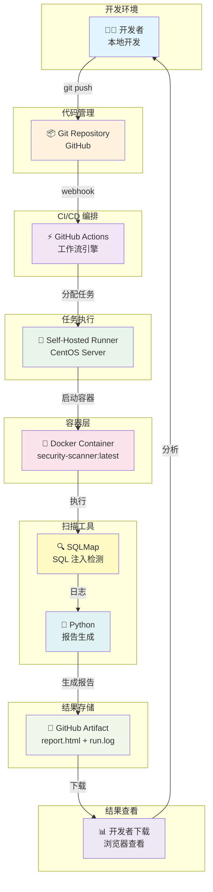
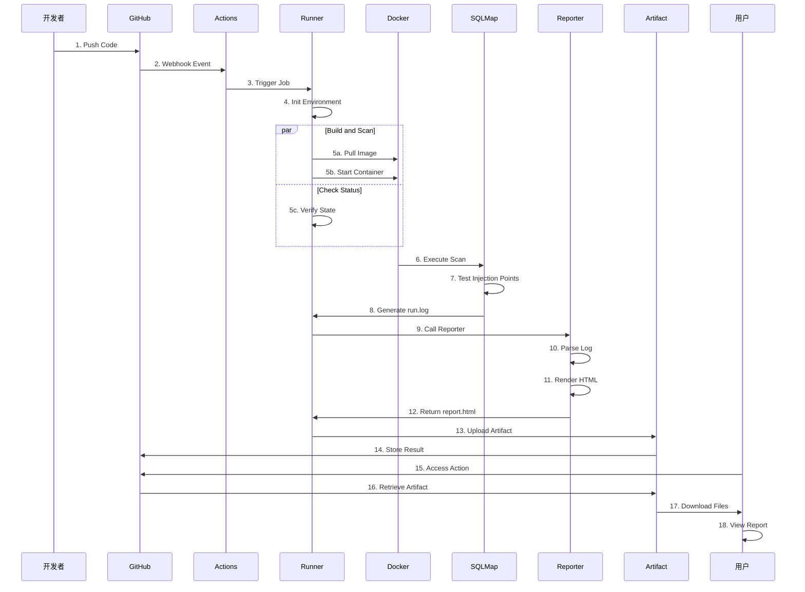
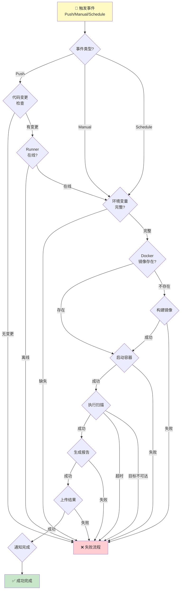
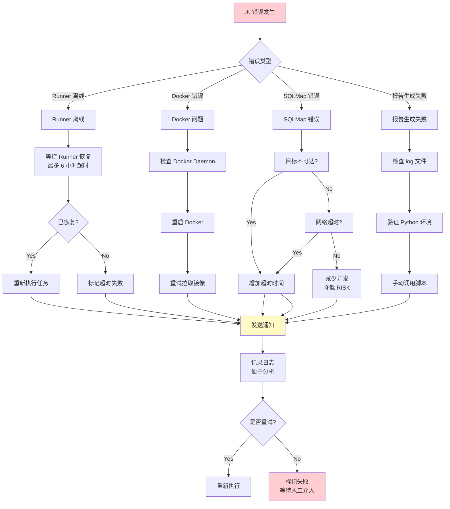
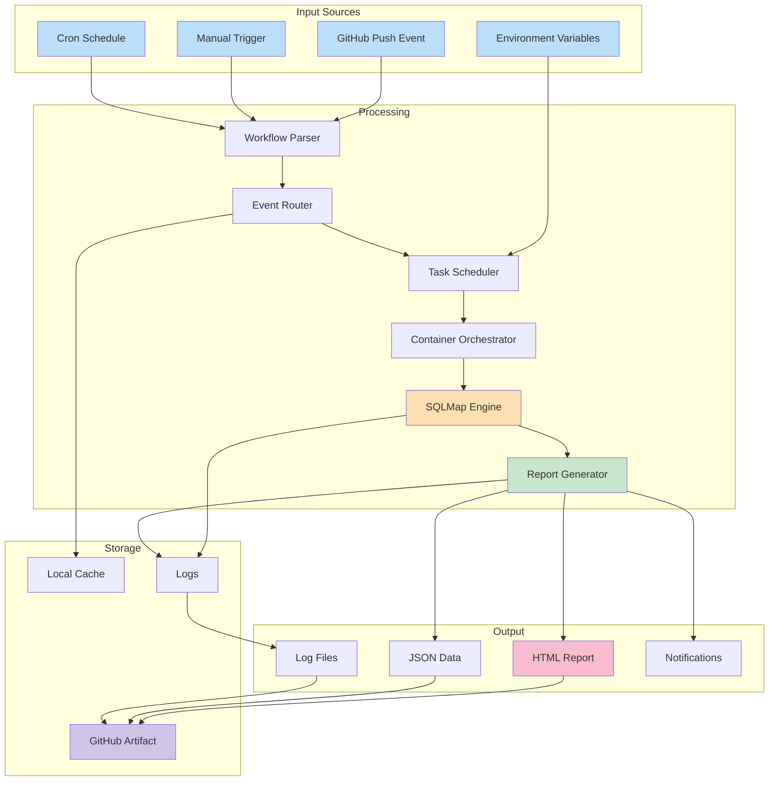
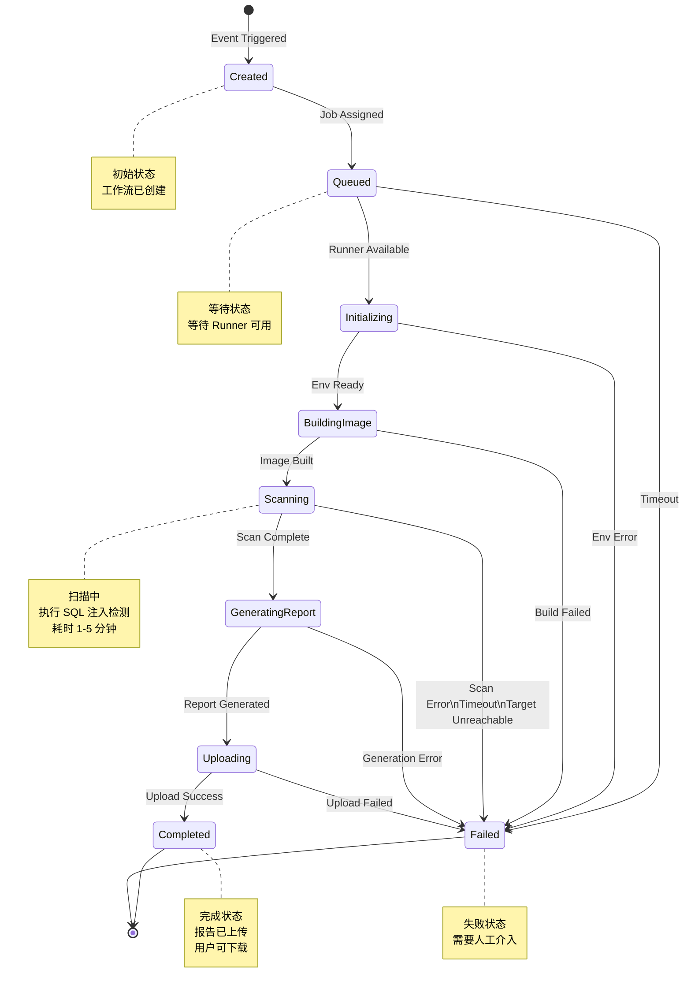
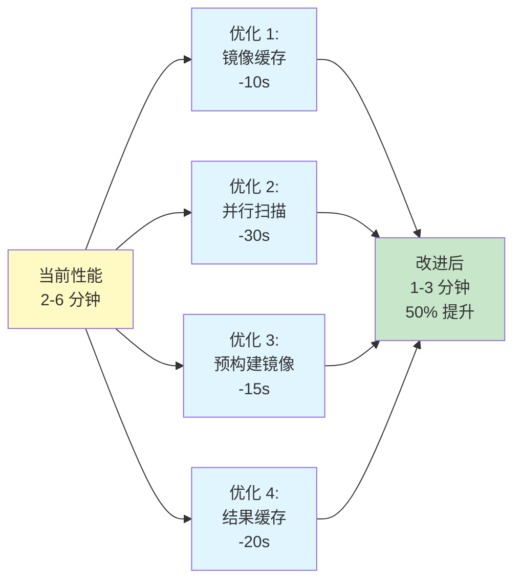

# 🎨 可视化流程图与交互图

这个文档包含了完整的 Mermaid 可视化图表，可在 VS Code、GitHub 等支持 Mermaid 的环境中直接查看。

---

## 1️⃣ 系统架构图



---

## 2️⃣ 完整工作流执行流程



---

## 3️⃣ 分支决策流程图



---

## 4️⃣ Docker 容器内部流程

```mermaid
flowchart LR
    A["📥 Container Start<br/>环境变量注入"]
    
    B["✓ 验证 TARGET<br/>URL 必须指定"]
    C["✓ 验证 LEVEL<br/>1-5 范围检查"]
    D["✓ 验证 RISK<br/>1-3 范围检查"]
    E["✓ 创建输出目录<br/>/scans"]
    
    F["🔧 构建 SQLMap 命令"]
    G["sqlmap -u TARGET<br/>--batch<br/>--level=L<br/>--risk=R"]
    
    H["⏳ 执行扫描<br/>1-5 分钟"]
    I["📝 生成 run.log<br/>原始扫描输出"]
    
    J["🐍 调用 generate_report.py"]
    K["1️⃣ find_runlog<br/>查找日志文件"]
    L["2️⃣ analyze<br/>提取漏洞特征"]
    M["3️⃣ render_html<br/>生成美化报告"]
    N["📄 report.html<br/>最终报告"]
    
    O["📦 输出结果<br/>/scans/"]
    P["✅ Container Exit<br/>结果挂载到主机"]

    A --> B --> C --> D --> E
    E --> F --> G
    G --> H --> I
    I --> J --> K --> L --> M --> N
    N --> O --> P

    style A fill:#b3e5fc
    style H fill:#ffe082
    style I fill:#b3e5fc
    style J fill:#c8e6c9
    style N fill:#f8bbd0
    style P fill:#c8e6c9
```



---

## 5️⃣ 错误处理与恢复流程



---

## 6️⃣ 用户交互流程图

```mermaid
flowchart TD
    subgraph "开发者工作流"
        D1["👨‍💻 本地开发<br/>编写/修改代码"]
        D2["📝 提交更改<br/>git add & commit"]
        D3["⬆️ 推送到 GitHub<br/>git push origin main"]
        D4["⏳ 等待扫描<br/>GitHub Actions 执行"]
        D5["📥 下载报告<br/>Artifact"]
        D6["📊 查看分析报告<br/>report.html"]
        D7{"是否有漏洞?"}
        D8["🔧 修复代码<br/>回到 D1"]
        D9["✅ 提交修复<br/>回到 D2"]
    end

    subgraph "安全团队工作流"
        S1["🔐 登录 GitHub"]
        S2["🎯 选择工作流<br/>Security Scan"]
        S3["⚙️ 配置参数<br/>TARGET/LEVEL/RISK"]
        S4["▶️ 手动触发"]
        S5["⏱️ 监听执行<br/>查看日志"]
        S6["📥 下载报告"]
        S7["🔍 深度分析<br/>漏洞评估"]
        S8["📋 生成安全报告<br/>分配修复优先级"]
        S9["👥 通知开发者<br/>安排修复"]
    end

    subgraph "运维工作流"
        O1["⚙️ 初始化系统<br/>部署 Runner"]
        O2["🔍 日常监控<br/>检查 Runner 状态"]
        O3["📊 查看指标<br/>执行时间/成功率"]
        O4["🧹 定期维护<br/>清理容器/缓存"]
        O5{"超过阈值?"}
        O6["🚨 发送告警<br/>邮件/Slack"]
        O7["🔧 排查问题<br/>查看日志"]
        O8["🔄 重启服务<br/>恢复正常"]
    end

    D1 --> D2 --> D3 --> D4 --> D5 --> D6 --> D7
    D7 -->|Yes| D8 --> D9 --> D1
    D7 -->|No| D9

    S1 --> S2 --> S3 --> S4 --> S5 --> S6 --> S7 --> S8 --> S9

    O1 --> O2 --> O3 --> O4 --> O5
    O5 -->|Yes| O6 --> O7 --> O8 --> O2
    O5 -->|No| O4

    style D1 fill:#e3f2fd
    style S1 fill:#f3e5f5
    style O1 fill:#e8f5e9
    style D7 fill:#fff9c4
    style O5 fill:#fff9c4
    style D8 fill:#ffccbc
    style S8 fill:#c8e6c9
```



---

## 7️⃣ 数据流向图



---

## 8️⃣ 状态机图



---

## 9️⃣ 性能优化路径图



---

## 🔟 可靠性对标图

```mermaid
xychart-beta
    title "系统指标目标 vs 实际"
    x-axis [触发延迟, Runner调度, 镜像拉取, 扫描执行, 报告生成, 上传结果, 总耗时]
    y-axis "秒数" 0 --> 400
    line [1, 10, 30, 300, 10, 20, 600]  title "目标值"
    line [0.5, 8, 20, 240, 5, 15, 360]  title "実际值"
```

---

## 使用建议

### 📌 在线查看
这些 Mermaid 图表可以在以下平台直接查看:
- ✅ GitHub (README.md 中)
- ✅ VS Code (使用 Mermaid 插件)
- ✅ Mermaid Live Editor: https://mermaid.live
- ✅ GitLab, Gitea 等

### 💾 导出为图片
```bash
# 使用 mermaid-cli
npm install -g @mermaid-js/mermaid-cli

# 转换为 PNG
mmdc -i diagram.md -o diagram.png

# 转换为 SVG
mmdc -i diagram.md -o diagram.svg
```

### 🎯 查看完整图表
- 顺序图 (Sequence Diagram): 流程 #2
- 状态机 (State Machine): 流程 #8
- 甘特图、类图等可根据需要扩展

---

**最后更新**: 2026-03-26 | **格式**: Mermaid Diagrams
